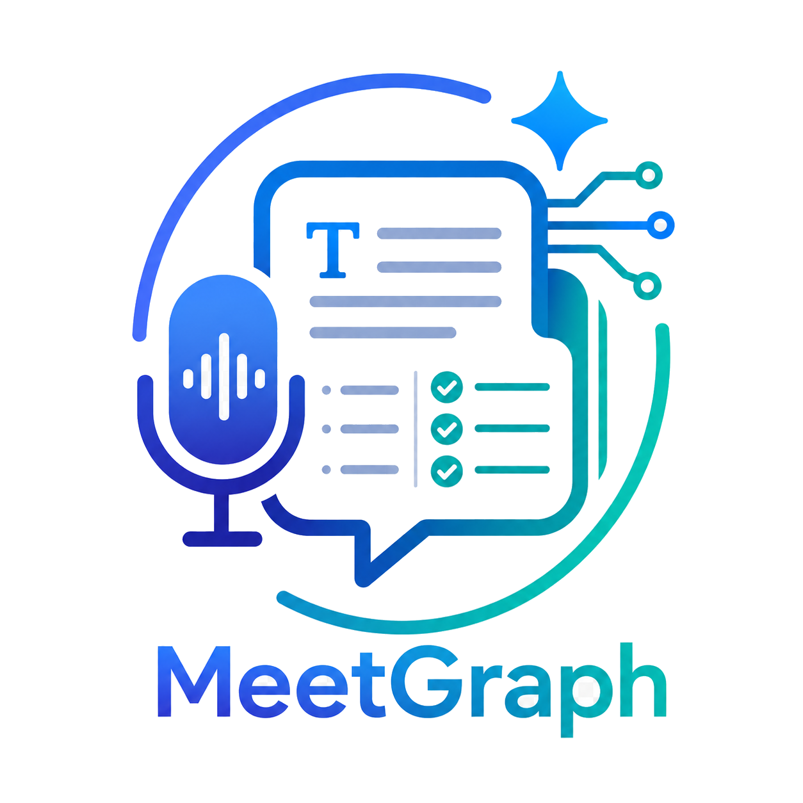
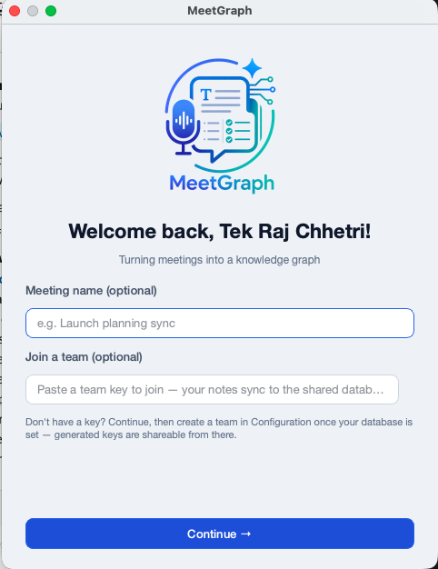
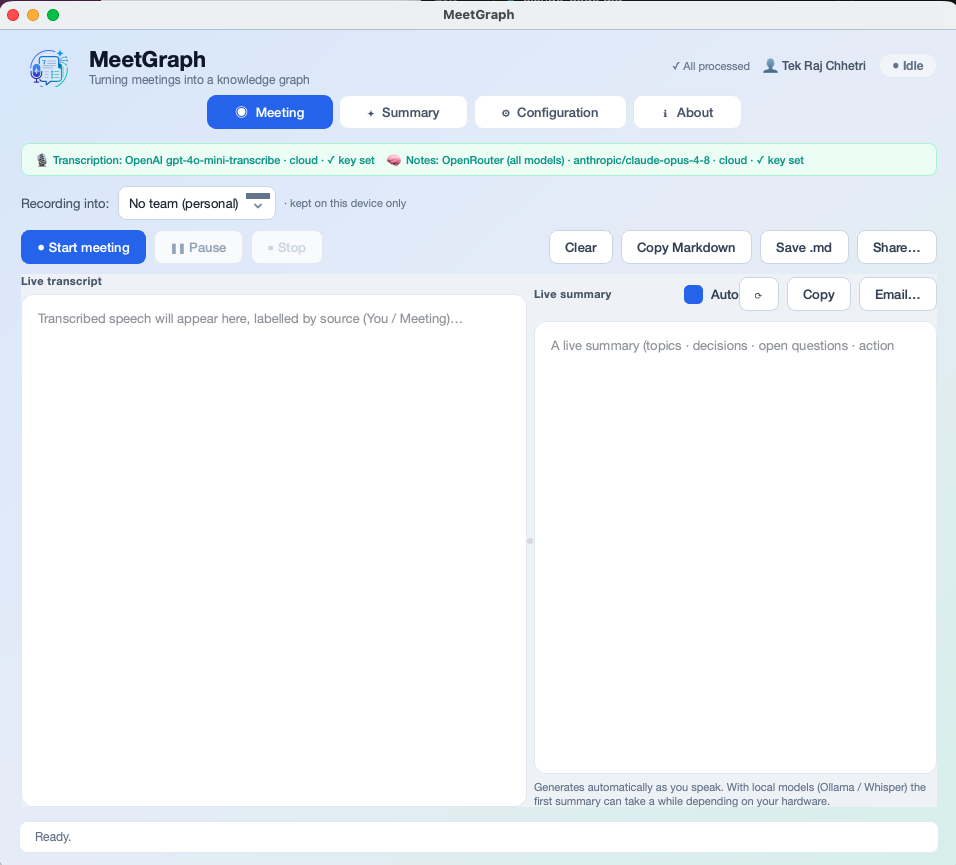
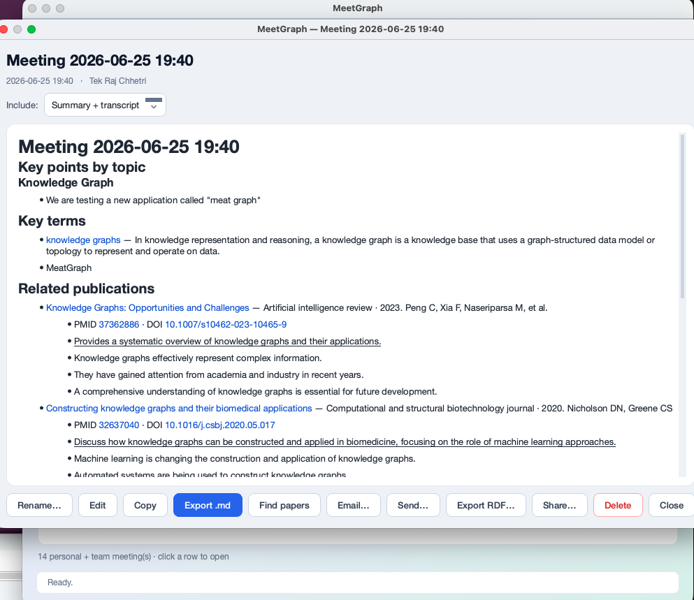
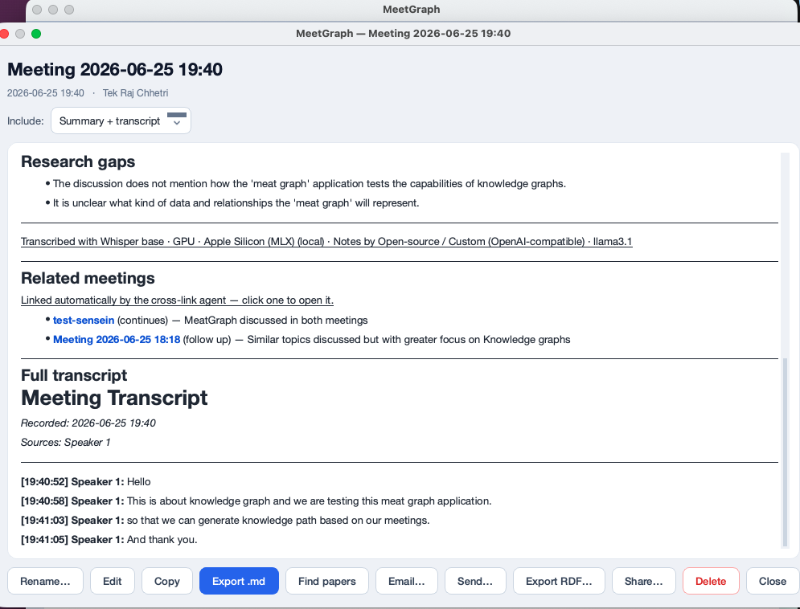
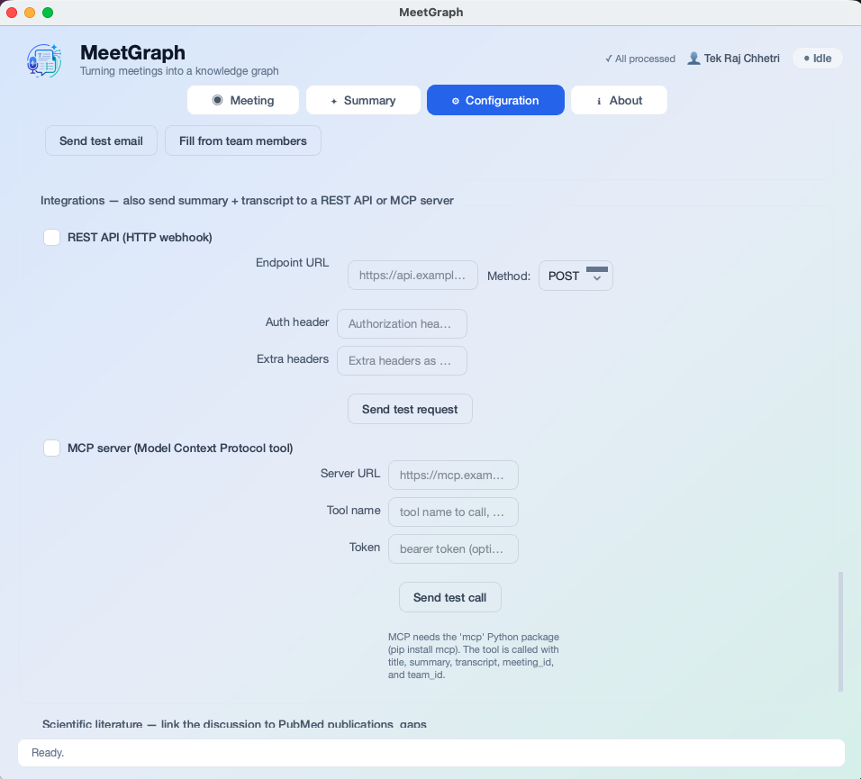

<p align="center">
  
</p>

# MeetGraph

> *Turning meetings into a knowledge graph…*

A cross-platform desktop app (PyQt6) that records your **microphone** *and* the
**meeting/system audio** (Zoom, Teams, Meet, …), transcribes both in **real time**,
and turns the conversation into structured, linked, shareable knowledge.

- 🎙️ Captures mic + system audio with **on-device speaker diarization** — distinct voices are labelled *Speaker 1 / 2 / …* in the live transcript (Resemblyzer, no token, runs locally)
- ⚡ Live transcription with voice-activity segmentation
- 🖥️ **Auto-detects the best accelerator** — Apple Silicon GPU (MLX), NVIDIA CUDA, or CPU
- 🔁 Transcription engines: **Local Whisper**, **OpenAI**, or any **OpenAI-compatible** audio endpoint (Groq, self-hosted, …)
- 🤖 **AI meeting notes** — a provider-agnostic Pydantic AI agent (Claude / OpenAI / OpenRouter / local Ollama) produces faithful notes (topics · decisions · open questions · action items), **fixes obvious transcription errors**, and is **editable** (with who-edited tracking)
- 🧾 **Model provenance** — records which transcription and notes models produced each result, in the notes and the knowledge graph; a banner shows the models + API-key status
- 🔗 **Key terms auto-linked to Wikipedia + Wikidata** (verified, clickable)
- 📝 **Personal & team notes** — write notes directly (no recording): they get the **same knowledge graph** as meetings (key terms auto-linked to Wikipedia/Wikidata, optional PubMed), can be kept **personal** or **shared to a team**, and can link to the meeting they're about
- 🔗 **Auto-link notes** (opt-in) — an agent connects each saved note to the **relevant meeting summaries and notes** (shared topics/entities); links show under *Related*, feed the graph, and sync to your team
- 🕸️ **Graph tab** — explore the whole knowledge graph visually (meetings · notes · shared key terms · teams · links); zoom/pan and **double-click a meeting or note to open and edit it** (edits sync)
- 🧠 **Knowledge graph** — every meeting *and note* exported as RDF (JSON-LD / Turtle / N-Quads) conforming to the bundled **MCO** ontology, with PROV temporal data
- 🕸️ **Automatic cross-meeting linking** — an agent connects related meetings (shared topics/entities, follow-ups, continuations)
- 🔬 **PubMed** — for scientific discussions, links relevant publications (with a few key points each) and proposes **research gaps**
- 👥 **Teams** — shareable keys centralize everyone's notes in one shared database; **join multiple teams and switch between them**; pick the team per meeting (or none) right in the Meeting tab; in-app team feed; audit log of who-did-what
- 🔐 **Leave/revoke keeps your history** — leaving a team or having your key revoked keeps its notes viewable **read-only up to that moment** (configurable); a valid key you left **re-joins on selection** without re-pasting
- 🗄️ **Bring your own database** — relational (PostgreSQL/MySQL/SQLite via SQLAlchemy) **or MongoDB**, and a **graph triplestore** (Oxigraph/Fuseki/GraphDB/Blazegraph) — endpoints auto-derived by type
- 📤 **Send anywhere** — email (SMTP), REST webhook, MCP server — per-meeting or in bulk, with de-duplication
- 🔄 Background enrichment with **status + auto-resume** if interrupted
- 💾 Local **SQLite** storage; searchable summary table (filter by **Personal / All / a team**, with a **Team** column); per-meeting detail windows
- ❓ Built-in **Help** and **About** tabs
- 🌍 Works on **macOS, Windows, and Linux**

---

## Screenshots

**Welcome / intro** — first-run setup: your name, optional email, and a quick join field.



**Meeting** — live transcript with per-speaker labels, an auto-refreshing summary, the models banner, and the *Recording into:* team picker.



**Summary** — searchable meetings table with the **Show** scope (Personal / All / a team) and **Team** column; open any row for full notes + transcript.





**Configuration** — transcription engine + acceleration, AI notes provider, external databases, teams, email, integrations, and PubMed.



---

## 1. Install

Requires **Python 3.10–3.13** and the system **PortAudio** library.

```bash
# system audio library
#   macOS:         brew install portaudio
#   Debian/Ubuntu: sudo apt install portaudio19-dev libportaudio2
#   Fedora:        sudo dnf install portaudio
#   Windows:       bundled with the sounddevice wheel — nothing to install

python3.12 -m venv .venv
.venv/bin/python -m pip install -r requirements.txt   # Windows: .venv\Scripts\python
```

Optional extras are only needed for specific features and degrade gracefully if
missing: `mlx-whisper` (Apple-GPU transcription, macOS arm64), `pyoxigraph`
(graph export — included), `SQLAlchemy` + a DB driver (relational sync),
`pymongo` (MongoDB), `mcp` (MCP delivery).

## 2. Run

```bash
./run.sh        # or:  .venv/bin/python -m meeting_transcriber
```

First launch asks your **name** (and optional email, used for team activity logs).
Paste a **team key** here to join a team instantly.

---

## 3. Capturing meeting (system) audio

OSes don't let an app record other apps' audio directly, so route system audio
through a **virtual loopback** that appears as a normal input. The app
auto-detects the common ones.

- **macOS — BlackHole:** `brew install blackhole-2ch`, create a Multi-Output Device
  (your speakers + BlackHole) in *Audio MIDI Setup*, set it as output, then pick
  **BlackHole 2ch** in the app.
- **Windows — Stereo Mix / VB-Cable:** enable *Stereo Mix*, or install
  [VB-Audio Cable](https://vb-audio.com/Cable/) and pick **CABLE Output**.
- **Linux — PulseAudio/PipeWire monitor:** pick the device whose name contains
  `monitor`.

> Mic-only capture needs none of this — just leave *Meeting / system audio* unchecked.

---

## 4. Transcription engine & acceleration

Pick an engine in **Configuration → Transcription engine**:

| Engine | Notes |
|---|---|
| **Local — Whisper** | faster-whisper (CPU/CUDA) or **Apple MLX** (Apple-GPU). Free, on-device. |
| **OpenAI** | `whisper-1`, `gpt-4o-transcribe`, … (needs `OPENAI_API_KEY`). |
| **OpenAI-compatible** | Pick a provider (Groq, OpenRouter, Anthropic, local server, custom); endpoint auto-filled. Calls the standard `/audio/transcriptions` API, so new providers work as they add speech-to-text. |

The **Compute** selector auto-resolves to the best device (Apple GPU / CUDA / CPU);
unavailable options are disabled. Configured models are **pre-downloaded when you
leave Configuration**, so there's no cold-start wait on Start.

> Note: speech-to-text needs an audio model — Claude/Anthropic and OpenRouter don't
> offer one, so transcription uses Whisper/OpenAI/compatible. Your Claude/OpenRouter
> choice is still used to write the **notes**.

**Speaker diarization** (on by default, *Configuration → Speakers*): distinct voices
are labelled *Speaker 1 / 2 / …* in the live transcript, on-device via **Resemblyzer**
(bundled model, no token, no network). Cloud STT APIs don't return speaker labels, so
this is how speakers get separated. Diarization labels stay in the **transcript only** —
the **summary** describes *what was said*, not a per-person breakdown.

---

## 5. AI meeting notes

The live summary regenerates **automatically as you talk** (no button), and a
final pass runs on Stop. Notes are a faithful, schema-validated `MeetingSummary`
(meeting info · topics · decisions · open questions · action items · key terms),
following the bundled **`meeting-notes`** skill — never inventing owners, dates,
or decisions, but silently fixing obvious speech-to-text errors.

| Provider | Default model | Base URL |
|---|---|---|
| **Claude (Anthropic)** | `claude-opus-4-8` | default |
| **OpenAI** | `gpt-4o` | default |
| **OpenRouter** | `anthropic/claude-opus-4-8` | `https://openrouter.ai/api/v1` |
| **Open-source / Custom** | `llama3.1` | `http://localhost:11434/v1` (Ollama/vLLM/LM Studio) |

Summaries are **editable** — open a meeting, *Edit*, refine the Markdown; the editor
(name) and time are recorded. The notes also capture **model provenance** (which
transcription + notes models produced them), shown read-only and mirrored into the
knowledge graph; a banner at the top of the Meeting tab shows the active models
(open-source vs cloud) and whether the API keys are set.

**Key terms** are resolved to verified **Wikipedia** articles and **Wikidata**
entities (clickable). For **scientific** meetings (enable *Scientific literature*
+ optional NCBI API key), MeetGraph searches **PubMed**, attaches the relevant
publications with a few key points each, and lists **research gaps**.

CLI (also handles `.vtt` / `.srt`):

```bash
.venv/bin/python -m meeting_transcriber.agent transcript.md --provider anthropic   # --json for raw JSON
```

---

## 6. Knowledge graph & cross-meeting links

Each meeting exports as RDF — **JSON-LD / Turtle / N-Quads** — conforming to the
**Meeting Content Ontology** (`meeting_transcriber/skills/schemas/mco.yaml`), with
PROV temporal data (`startedAtTime` / `endedAtTime` / `generatedAtTime`), key-term
links, cited publications, and team membership.

- **Export RDF…** on a meeting, or **⬡ Export graph** for the whole connected corpus.
- After each meeting, a **cross-link agent** connects it to related meetings
  (shared entities/topics, follow-ups, continuations) — shown as *Related meetings*.
- Enrichment runs in the background with a **status** indicator and **auto-resumes**
  if the app was closed mid-process.

---

### Graph tab — explore & edit the knowledge graph

The **🕸 Graph** tab draws the whole graph: **meetings**, **notes**, the **key terms** they
share (shared terms link items together), **teams**, and the **links** between them (cross-meeting
links, note auto-links, note→meeting "about", team membership). Scroll to **zoom**, drag the
background to **pan**, **Fit** to recenter, and use **Show** to scope to Personal / All / a team.
**Click a meeting or note** (blue/teal) to open its editor — any edit there saves and **syncs** as
usual, then the graph refreshes.

## 7. Notes (personal & team)

The **📝 Notes** tab is for notes you write yourself — no recording involved. A note is
treated as first-class knowledge: on **Save & enrich**, a provider-agnostic AI pass extracts
its salient **key terms** and links them to **Wikipedia/Wikidata** (and, with *Scientific
literature* enabled, related **PubMed** papers), exactly as for meetings. Everything is stored
as RDF under the MCO ontology's new **`Note`** class.

- **Personal or team:** choose *No team (personal)* to keep a note on this device, or a team to
  sync it into that team's shared **relational + graph** databases (tagged with the team id).
- **Share a personal note:** open it and click **Share to team…** (or change its **Team**) — the
  note is pushed to the shared store and becomes visible to the team. Notes live in their own
  named graph (`…/meetgraph/notes`), so a full meeting re-sync never disturbs them.
- **Link to a meeting:** set **About meeting** to connect a note to the meeting it concerns
  (a `dcterms:relation` edge to that meeting in the graph).
- **Auto-link (opt-in):** tick **Auto-link new notes to related meetings & notes** on the Notes
  tab. On save, an agent finds genuinely related meeting summaries and notes (shared
  entities/topics), shows them under **Related meetings & notes**, writes the links into the
  knowledge graph (`prov:wasInformedBy` / `skos:related` / `dcterms:relation`), and syncs them to
  your team. Meeting and note ids are kept in separate spaces so they never collide.
- **Write like a doc:** the note editor is WYSIWYG — **Ctrl+B**/**Ctrl+I** and a toolbar give
  bold, italic, headings, lists, quotes, code and links, and it's stored as Markdown. A
  **⟨⟩ Markdown** toggle lets you type raw Markdown that renders when you switch back.
- **Clean view & export:** once saved, a note opens as a clean rendered page (body + its
  knowledge graph), with the **same options as a meeting summary** — **Export PDF**,
  **Export .md**, **Export RDF** (JSON-LD / Turtle / N-Quads), and **Email**. The Notes
  **Show** menu views **Personal / All / a team**; teammates' shared notes open read-only.
  Notes are included in **Sync all … now** backfills.

## 8. Storage, databases & teams

- **Local:** everything is stored in SQLite; the **Summary** tab is a searchable
  table; click a row for a detail window (copy / export `.md` / RDF / email / send).
- **External databases** (Configuration → *External databases*): mirror meetings to
  your own **relational** DB (PostgreSQL/MySQL/SQLite, or **MongoDB**) and/or a
  **graph triplestore** (Oxigraph/Fuseki/GraphDB/Blazegraph). Pick the DB type and
  enter a base URL — endpoints are derived automatically. **Storage mode**
  (Local + Remote / Remote only / Local only) and **Sync policy** (mirror incl.
  deletions / add-only) control what syncs. Enabling a DB auto-backfills existing
  meetings.
- **Teams:** generate a shareable **team key** (bundles the shared DB config) — issue
  several, view, copy, or **revoke** them. Teammates **join** with the key (on the
  welcome screen or in Configuration) and their notes flow into the shared DB.
  Each meeting carries a globally-unique id, so members never overwrite each other.
  - **Multiple teams & switching:** join several teams and switch the active one via
    **Teams…** or the **Recording into:** picker in the Meeting tab (or pick *No team
    (personal)*). The Summary tab's **Show** menu views **Personal**, **All**, or any
    one team, and a **Team** column makes rows distinguishable. A team view also
    includes your own local meetings tagged to it, so you see your contributions even
    before they sync.
  - **Leaving / revocation keeps your history:** by default, leaving a team or having
    your key revoked keeps that team's notes viewable **read-only up to that moment**
    (Configuration → *Keep read-only access…* toggles this). A team you **left** with a
    still-valid key **re-joins automatically when selected** — no need to re-paste it;
    only a **revoked** key requires a fresh one.
  - Every action (create / summary / delete / send / sync / join / leave / revoke) is
    recorded in an **audit log** with the member's name + email, mirrored centrally.

## 9. Sending & sharing

Send a meeting's summary + transcript to:

- **Email** (SMTP — Configuration → *Email*; "Fill from team members" pulls teammate addresses)
- **REST API** webhook (JSON payload)
- **MCP** server tool

Use **Email…/Send…** on a meeting, or **⇪ Send…** on the Summary tab for **bulk**
send across meetings — already-sent items are skipped (de-duplicated).

**Notes** support the same destinations: **Email…/Send…** on a note, or **⇪ Send…**
on the Notes tab for bulk send/sync (email, REST, MCP, relational + graph DBs).
Note delivery is de-duplicated independently of meetings, so they never clash.

---

## Project layout

```
meeting_transcriber/
  audio.py        # PortAudio capture + voice-activity segmentation
  transcribe.py   # Local (faster-whisper/MLX) + OpenAI/compatible engines; accelerator detection
  diarize.py      # On-device speaker diarization (Resemblyzer; pyannote fallback)
  transcript.py   # Transcript model, Markdown rendering, sharing helpers
  controller.py   # Threads: capture → queue → transcription → Qt signals
  agent.py        # Provider-agnostic notes agent; key-term + PubMed enrichment
  wikipedia.py    # Verified Wikipedia/Wikidata resolution
  pubmed.py       # NCBI E-utilities (search + abstracts)
  crosslink.py    # Automatic cross-meeting linking (deterministic + agent)
  kg.py           # RDF/knowledge-graph build & serialize for meetings + notes (pyoxigraph)
  external.py     # Relational/Mongo + graph sinks; team revocation registry
  email_send.py   # SMTP delivery
  delivery.py     # REST + MCP delivery
  team.py         # Shareable team keys
  storage.py      # SQLite (meetings + notes content DB + separate config DB; jobs, audit, links)
  ui.py           # PyQt6 window
  skills/         # Bundled "meeting-notes" skill + MCO ontology (schemas/mco.yaml)
  __main__.py     # entry point  (python -m meeting_transcriber)
```

## Notes & tuning
- Transcription is **segment-based**: speech is split on short silences and each
  utterance transcribed, so text appears a beat after you pause.
- Larger local models are more accurate but slower; `base`/`small` are a good
  real-time balance on Apple Silicon.
- The config database (API keys, DB credentials, team keys, memberships) is kept
  **separate** from your meeting content and is readable only by your user account.

## Troubleshooting

| Symptom | Fix |
|---|---|
| **Team feed empty / "Can't reach the shared graph database"** | The shared DB server isn't reachable. Check it's running and the URL/port are right, then **Test connection** (Configuration → graph DB). Once reachable, **Sync all meetings now** to backfill. Your own meetings still show under the team view locally even before they sync. |
| **Everyone shows as one speaker** | Diarization needs the bundled Resemblyzer (`pip install -r requirements.txt`); make sure *Configuration → Speakers* is set to *Label speakers (local)*. Very short or overlapping utterances may be mislabelled. |
| **Transcription model error (e.g. `gpt-realtime-…`)** | Use a real `/audio/transcriptions` model: `whisper-1`, `gpt-4o-transcribe`, or `gpt-4o-mini-transcribe`. Realtime models aren't supported. |
| **"Set an API key…"** | The notes provider (Claude/OpenAI/OpenRouter) needs a key in Configuration. The top-of-Meeting banner shows key status. |
| **Joined a team but can't see meetings** | Pick the team (or **All**) in the Summary **Show** menu; confirm the shared DB is reachable (above). |
| **Left a team — how do I get back?** | If the key isn't revoked, just pick it in the Meeting **Recording into:** picker (shown as *(rejoin)*) — it re-joins automatically. A revoked key needs a fresh one. |

In-app, see the **❓ Help** and **ℹ About** tabs.
```
